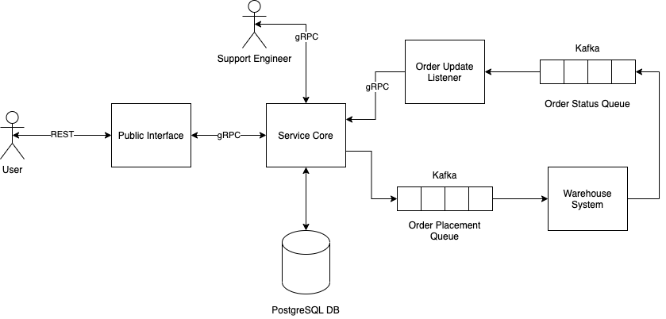

# New Hire Onboarding Workshop Introduction

## Why Micro-Services?

When building a large system, the issue of complexity always arises. Beyond the complexity of the domain problem being modeled, there is the additional complexity introduced by the process of actually creating the product (complexity arising from changing requirements, misunderstood features, technical debt accrued by deadlines etc.). When dealing with a sufficiently large system, this additional complexity can cripple the progress of a product. Therefore, seeking to recognise the inherent (domain) complexity and reduce the impact of the development (process) complexity is crucial to be able to deliver and adapt in a competitive market.

One way to address the above problem is to use a micro-service architecture. This breaks down functionality into small, self contained applications that focus on addressing one specific part of the domain (e.g. user management, authorisation, auditing user actions etc.). Whilst it does not reduce the inherent complexity of the whole system, as the feature set remains the same, it effectively uplifts it from the application code to the inter-service communication and architecture layer. This allows teams to focus on reducing the process complexity for the specific micro-service that they are working on.

From a technical point of view, micro-services also facilitate decoupling and parallel development to a better degree as each micro-service can be developed in isolation, using mocks for the external components that it requires. This allows independent teams across multiple geographies to collectively build up a system’s functionality with fewer conflicts than if they were all working on the same codebase.

There are of course downsides to using micro-services. If care is not taken when designing the service interactions, it can introduce large amounts of complexity into the system as each micro-service effectively loses it’s ‘independent’ status. It also means that without discipline a large amount of testing only happens at the ‘integration’ stage.

## Aim of the Workshop

This guide has two aims, to help you learn how to build applications using Go, and to serve as a ‘my first DSCC service’ guide. It will cover general engineering topics such as database interactions and application architecture, as well as DSCC specific technologies.

The guide assumes that you are already familiar with the language constructs of Go (e.g. structs, interfaces, functions etc.), and are comfortable writing and reading Go code. If this is not the case, we recommend starting with learning the language using these [resources](https://confluence.eng.nimblestorage.com/display/NCS/Go+Learning+Resources).

To avoid information overload, this guide deliberately ignores (or in some cases takes a simplistic view towards) topics such as Authentication/Authorisation, CI/CD and Kubernetes. However, it should give you the grounding you need to work with an existing DSCC service’s codebase, and enough of an idea of what you need to go look at when creating a new service.

The guide (currently) focuses on the backend part of DSCC systems, and does not include a UI component. However, a good extension once the guide is completed would be to have a go at building a UI for the REST interface that we will build.

The guide is written in a ‘code along’ style, with most chapters having an ‘exercise’ of some sort that asks you to either write some code, or refactor code that was written in a previous exercise. For each of these exercises we provide some hints and an example answer. We encourage you to avoid just looking at the example solution before having a go at writing the code yourself. 

We also recommend that you get members of your team to look over the code you are writing now and then (we’ve indicated in the guide which points we think it is good to do this). Whilst we provide example solutions, there is nothing better than interactive feedback. If there is no one on your team available to give feedback, or if your whole team is new to Go, then please reach out to the [CDS Go Chapter]([https://clouddataserviceshq.slack.com/archives/C01UW7TCQSH](https://clouddataserviceshq.slack.com/archives/C01UW7TCQSH)) who are more than happy to help.

## What’s In This Workshop

The guide is broken up into three ‘sections’, each focusing on a different DSCC technology, which themselves are broken down into ‘chapters’ which will assist you through the process of building out the solution. Depending on your previous experience, you may wish to skip parts that you already know, but we do encourage you to at least skim through each of them.

The exercises in this guide are additive, and should not be performed in isolation. Rather, it is a good idea to create a personal git repository to hold the whole solution and complete each exercise in a branch, merging back to master once you are satisfied with the code. This will also make code reviews for the exercises quite easy as they can be opened as pull requests back to master. If you need some basic git training, you can find some resources [here](https://docs.github.com/en/get-started/quickstart/git-and-github-learning-resources).

For this guide we will be developing the beginning of an e-commerce system where a user can order an item and then view the progress of their order as it is fulfilled. This was selected (contrasted against something directly to do with HPE Storage) to develop the fundamental concepts to be understood without the complication of domain specific knowledge.

At the end of this guide, we will have built an e-commerce system with the following components:

- A container providing a REST interface that a user can use to place orders, and query the status of their orders.
- A container that handles the business logic of the application, including communication with the database. It will communicate with other containers via gRPC.
- A container that acts as a simulation of the warehouse, which asynchronously handles orders placed on the order queue via Kafka, and provides updates on the status of those orders.
- A CLI for use by support personnel to inspect the state of the system.

A simple overview of the solution is presented in the below diagram.

Each section of the guide is focused on one of these components, however, some exercises will involve going back to previous sections and refactoring them based on concepts introduced in later sections.

## Glossary

TODO:
* REST
* gRPC
* Kafka
* CLI
* CI/CD
* DSCC
* Docker
* Kubernetes
* CDS
* PostgreSQL
