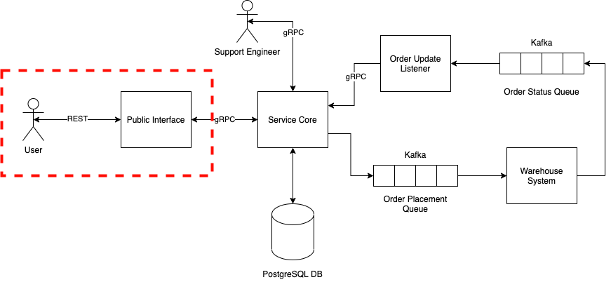

# Section 1: Public REST Interface

## REST in DSCC

For web APIs, REST has become the standard method for separate components of a system to communicate, built on top of HTTP (and making use of some of it’s concepts, such as HTTP methods). If you are not sure on what REST is or what the components of REST are, a resource can be found [here](https://www.codecademy.com/article/what-is-rest). Commonly REST APIs make use of XML or JSON (these days it’s JSON unless there is a legacy reason for using XML) as the data format as it provides flexibility in expression whilst also being human readable. 

One of the reasons for REST’s popularity is also one of it’s downsides. Due to being based on the HTTP protocol, and using JSON for data structure, it is a very flexible solution that does not require a client and server to share any code or interfaces. JSON blobs map closely to the map/dictionary data structure, and almost all languages have utilities to serialise and deserialise JSON blobs to structs/objects. However, any undocumented interface is a problem, especially if it is possible for one side to make a breaking change without forcing the other side to update (e.g. a field in the data model is deprecated, and so the server starts ignoring that field in requests without the client knowing that the field is now ignored).

To resolve this problem, we use [OpenAPI](https://spec.openapis.org/oas/latest.html) to provide a specification for our REST interfaces. This allows both clients and servers to have an agreed contract for communication between them. Whilst we will not cover it in this workshop (as we currently don’t have it in place in DSCC), it is generally good practice to generate your client and server code from the OpenAPI spec.  

In DSCC we use REST for all our publicly available interfaces. This is not only our public API that customers can code up against, but also includes our UI components, which are running in the customer’s browser. As mentioned, UI code is beyond the scope of this guide, but the REST API for the system can be seen as a good summary of what capabilities of the system are available for the UI to be built around.

## Section Overview

In this section we are going to build the first component of our system, the container that is serving the public REST interface. As highlighted at the start, one of the benefits of working in a decomposed environment is that components can be developed in isolation. Therefore, for this section we will just mock out the rest of the system by keeping an in memory record of orders.

We will start simple, running through how to stand up a REST server in Go, before following up with some code decomposition and structure. Finally the section finishes with an intro to testing (both unit and functional) and containerisation.

Figure 2. Highlighting the part of the system that will be build in Section 1.

### Prerequisites:

- Go - [Installation Guide](https://go.dev/doc/install)
- Docker - [Installation Guide](https://docs.docker.com/get-docker/)
- Git - [Installation Guide](https://git-scm.com/book/en/v2/Getting-Started-Installing-Git)

# REST API

In terms of public facing features, for this system we want the user to be able to:
* Place an order
* List their orders
* Get details about an order, including the current delivery status

As discussed above, a good REST API comes with a specification and the one for the REST API that we are going to build can be found [here](./rest-api-spec.yaml). We will be creating a REST server that conforms to the spec, that is containerised and well tested.
